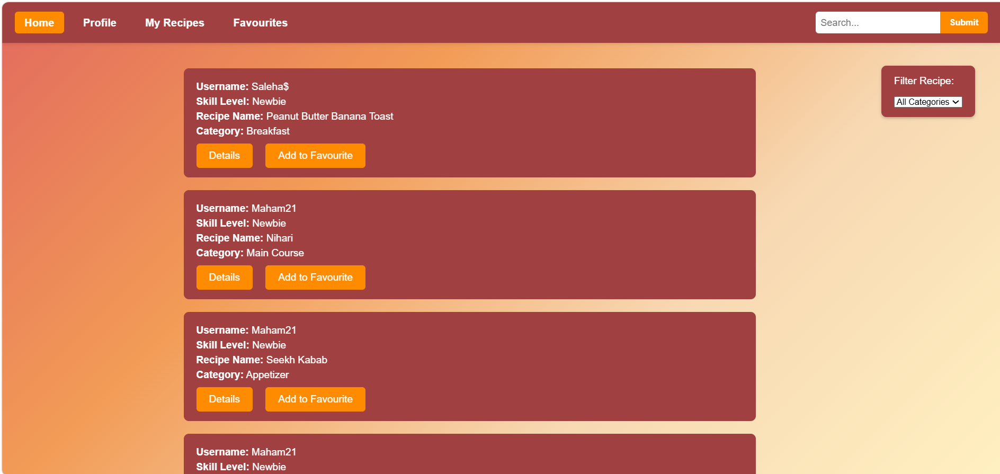
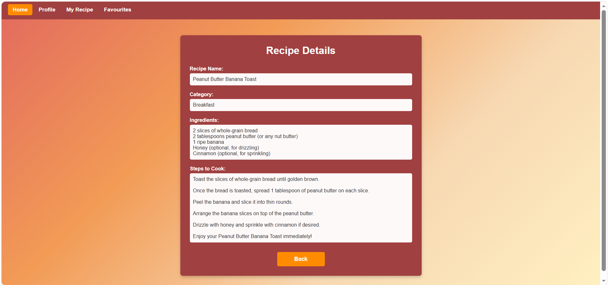

# Digital Recipe Book

## Overview
The Digital Recipe Book is an ASP.NET application that enables users to create, manage, and discover recipes through a secure and user-friendly interface.

## Features
- User Registration & Login
- Recipe Management (CRUD)
- Search & Filter Recipes
- Favorites System
- Badge & Skill Level System
- Profile Update Log using SQL Triggers
- Community Recipe Sharing

## Technologies Used
- ASP.NET
- C#
- SQL Server
- HTML
- CSS

## Screenshots

### Home Page

### Dashboard

### Recipe Details

